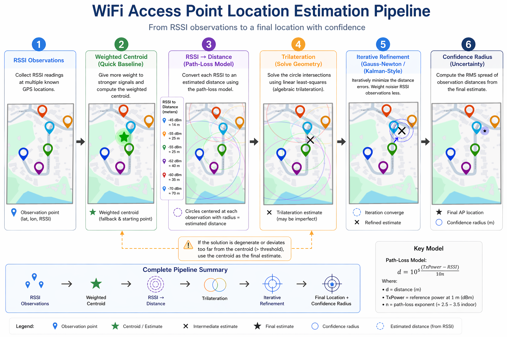
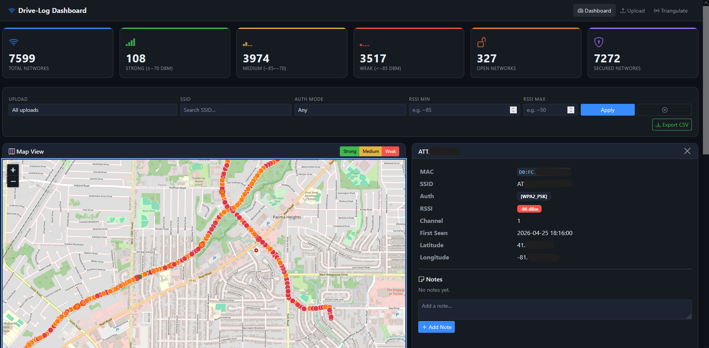
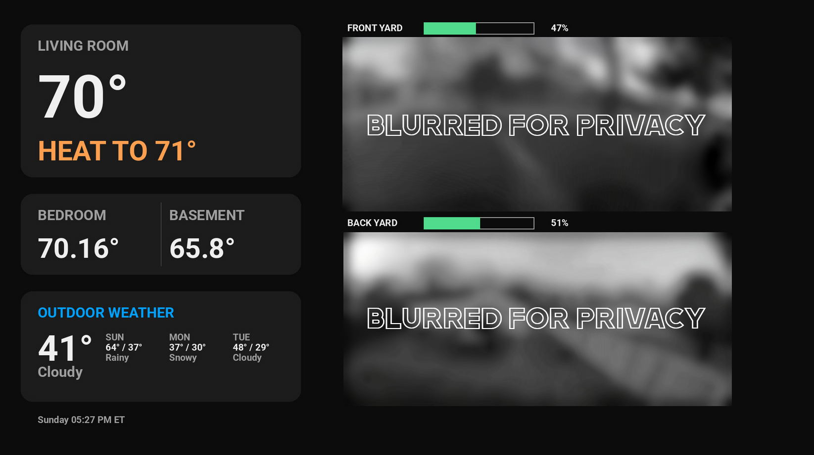

---

Software developer focused on automation, backend systems, and practical tools that make everyday work easier.

---

## Featured Project

## War Drive Dashboard

An interactive, full-stack web dashboard for visualising and annotating wardriving logs. Accepts .log or .csv files, explores networks on a live Leaflet map, search/filter the full data table, and leave persistent notes on individual entries.

This system estimates access point locations using RSSI-based trilateration (distance-based localization, and the inverse of the left figure). Distances are derived from a path-loss model and used to compute an initial position estimate, which is then refined via iterative weighted least-squares (Gauss–Newton, right figure).

  
  

---

## Other Projects

An AI-powered real estate intelligence platform designed to identify all characteristics of a neighborhood by analyzing geospatial and infrastructure data.

Focus areas:
- geospatial data pipelines
- automated property intelligence reports
- AI-assisted analysis
- some characteristics included are nearby school, crime data, noise pollution, average income/age/house-price, affordability metrics, and many more

### VWAP Auto Trader
An algo-trading bot that looks for a combination of signals and places market orders based upon previous automated paper trading data. 

Focus areas:
- set it and forget it
- algorithmic training and building
- ability to easily switch between paper/live, and multiple platforms  

<ins>Supported Platforms</ins> 
         

### Home Automation System
A fully custom home automation ecosystem built around Home Assistant, integrating both off-the-shelf and self-built sensors/hardware

This systems aggregates data from thermostats, security cameras, custom ESP-32 based sensors (temperature, humidity, motion), and external api's for outdoor weather/forecast, and commute times. This data is then neatly injected into a custom dashboard, where an image is created and published.

 

Displaying this information is done through a custom Brightscript application sideloaded onto a Roku TV. The home automation system automatically turns this tv on/off and opens the application, no user intervention necessary.

**Focus areas:**
- IoT system design
- Embedded development (ESP32)
- Real-time data aggregation
- Custom display platforms (Brightscript / Roku)

### Workday Boredom Buster
A browser-based game disguised as productivity software.

The application simulates realistic professional environments (spreadsheets, IDEs, terminals) while hiding lightweight games underneath. The goal is simple: make something that *looks like work* while secretly being entertainment.

Examples include:
- Spreadsheet-style games hidden inside grid cells
- IDE typing challenges
- Terminal-based puzzles

Runs entirely in the browser with no backend or data storage.

https://workdayboredombuster.com
---

## Professional Work

At work in the Space and Defense sector, I develop automated testing software used to validate **mission-critical hardware components**. Going the extra mile, I assist in curating test racks that align with the specific hardware's needs

These systems focus on:
- automated hardware validation
- instrumentation control
- reliability testing
- fault detection and diagnostics
- data logging and analysis

---

## Technical Interests

- automation systems
- backend engineering
- testing frameworks
- AI-assisted tooling
- geospatial data analysis

---

## Collaboration

I enjoy working on passion projects and experimental software ideas.  
If you're building something interesting, feel free to reach out.
